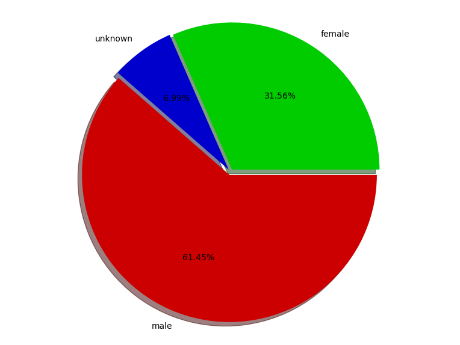
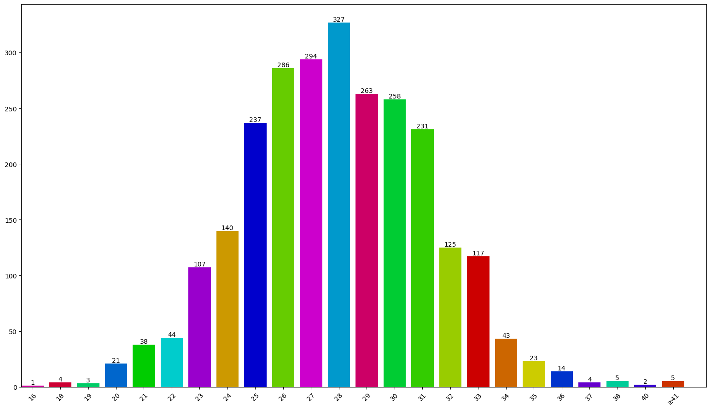
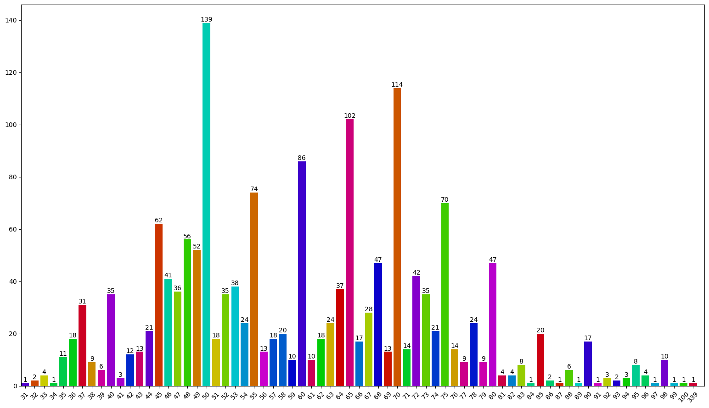
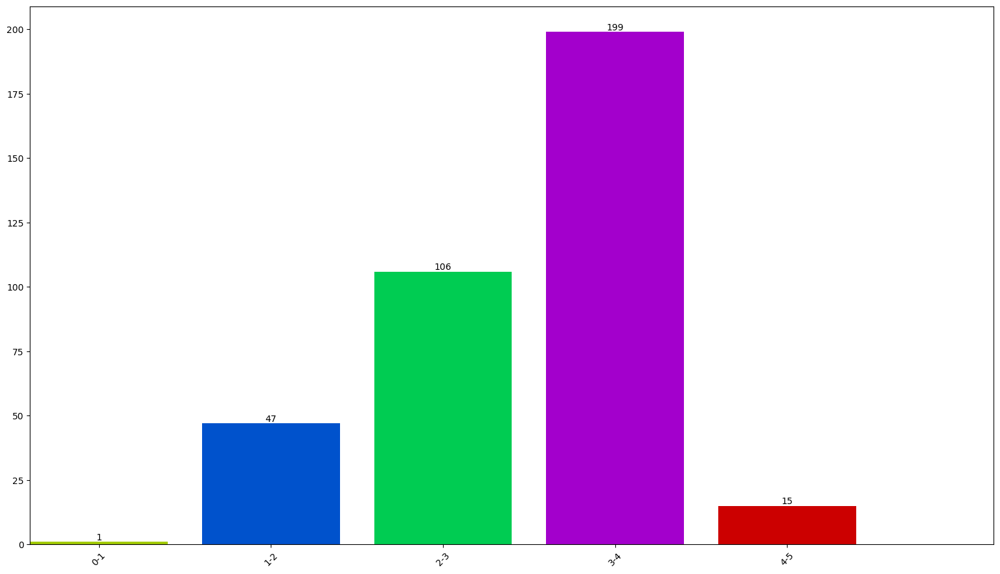

# soulmate

本项目爬取了知乎中[你的择偶标准是怎样的？](https://www.zhihu.com/question/275359100/answer/622591897)下所有回答，提取出答主的一些信息。

与原来代码不同的是，我把所有图片都保存下来了，百度免费的API不太好使！

## 概览
1.共爬取4708个回答，和56286条评论.
2.共爬取20319条性别信息，性别占比如下图所示：

3.共爬取2592条年龄数据，年龄分布如下图所示：

4.共爬取2349条身高数据，身高分布如下图所示：

5.共爬取1683条体重数据，体重分布如下图所示：</br>

6.共爬取368条颜值数据，颜值分布如下图所示：

7.答主个性签名词云图如下图所示：</br>

8.该问题下的回答趋势图如下图所示：</br>

9.所有评论的词云图如下图所示：</br>


## 总体思路
1.登陆：使用selenium模拟登陆知乎，获取cookies，然后将cookies保存至本地，为了避免被反爬，每次爬取随机延时
2.数据库：MySQL数据库存储爬取的数据
3.redis：保存爬取的回答ID，避免爬虫中断后重新爬取。这里我用的是windows版的redis5.0
4.性别：首先获取知乎性别，但知乎性别很多都是假的，于是用图片的人脸识别出的性别替换知乎性别，又由于图片可能是表情包，于是又从回答内容中正则出性别，以保证性别获取尽可能准确。
5.颜值：使用百度人脸识别API，为了尽量减少表情包的影响，屏蔽掉人脸概览小于0.7的图片和颜值小于40的图片。
6.数据清洗：

>(1)性别为女的体重进行转换和过滤，将大于80的数据转换成kg，将小于40的数据屏蔽掉
(2)性别为男的体重进行过滤，将小于50的数据屏蔽掉
(3)通过身高过滤性别，身高大于180的统一为男，身高小于160的统一为女
(4)通过评论者的性别过滤答主的性别，评论中性别为男的居多，则答主性别为女；反之亦然
(5)通过回答内容过滤性别，例如“希望他”、“，女，”、“老阿姨”、“女的，活的”、“爱好男”、“要求男”等
(6)再次通过性别过滤体重</br>

  以上牺牲少数，保证多数数据正确，不可避免一些数据过滤出错，因此结果仅供参考。

## Installation
1. Clone soulmate repository
	```Shell
	$ git clone https://github.com/leeyoshinari/soulmate.git
    $ cd soulmate
	```

2. Scraping
	```Shell
	$ python main.py
	```
	
3. Plotting
	```Shell
	$ python dealData.py
	```

## Requirements
>1. matplotlib
>2. pymysql
>3. redis
>4. scrapy
>5. jieba
>6. wordcloud
>7. baidu-api
>8. selenium
>9. chrome webdriver
